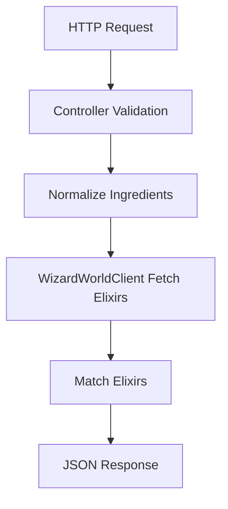
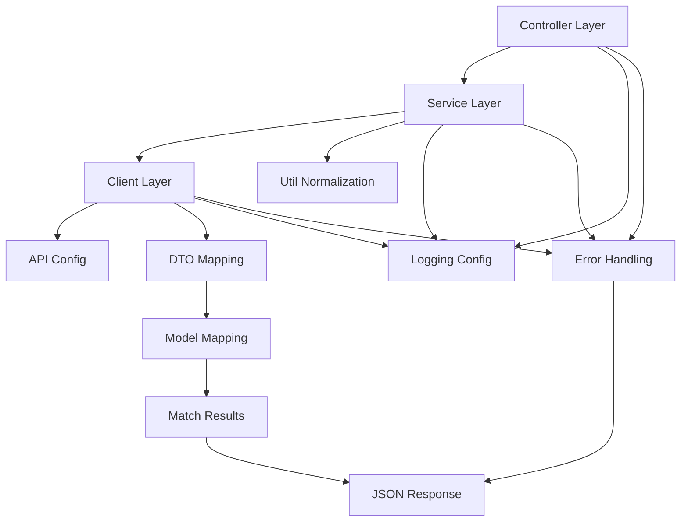
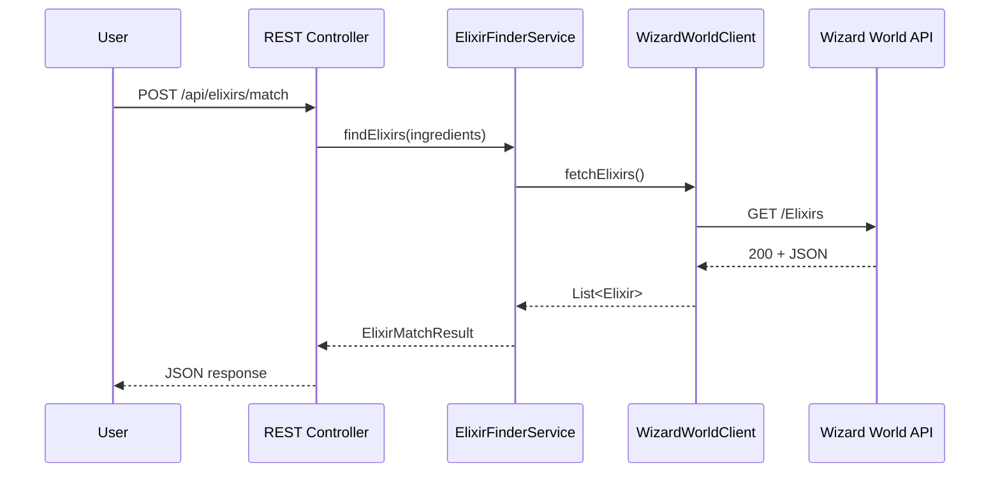
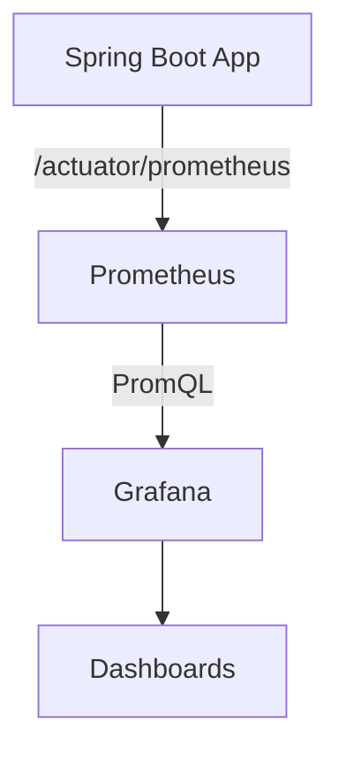

# Architecture

## Overview
This project is a Spring Boot REST service that determines which Wizard World elixirs (potions) can be brewed from a user-provided set of ingredients. The service integrates with the Wizard World API, normalizes ingredient data, and computes a feasible set of elixirs based on available ingredients.

The key goals are:
- Clear separation between REST, service logic, and API client integration.
- Deterministic, testable matching logic.
- Resilient network behavior with helpful HTTP error responses.

## High-Level Flow
1. Accept REST request with ingredient list.
2. Validate and normalize ingredient inputs.
3. Fetch ingredient and elixir datasets from the Wizard World API.
4. Build a normalized ingredient index.
5. For each elixir, check whether all required ingredients exist in the available set.
6. Return JSON response with matched elixirs.









## UI References

Bruno collection:


Grafana dashboard:


## Proposed Modules

### 1) Controller Layer (`src/main/.../controller`)
**Responsibilities**
- Accept REST requests and validate input.
- Return structured JSON responses.
- Surface errors with appropriate HTTP status codes.

**Interfaces**
- `ElixirController` – REST endpoints for matching, listing, and health checks.

### 2) Service Layer (`src/main/.../service`)
**Responsibilities**
- Orchestrate the flow: input normalization, data retrieval, matching, output.
- Handle errors and fallback behaviors.

**Interfaces**
- `ElixirFinderService` – public entrypoint for matching elixirs.

### 3) Model Layer (`src/main/.../model`)
**Responsibilities**
- Core matching algorithm and data model.

**Entities**
- `Elixir` – name, effect, list of required ingredients.

**Algorithm**
- Build `Set<String>` of available ingredients.
- For each elixir:
  - Normalize the required ingredient names.
  - If every required ingredient is in available set, include elixir.

**Complexity**
- Index creation: O(n) for ingredients.
- Matching: O(m * k) for m elixirs and k ingredients per elixir, using hash-set membership.

### 4) Client Layer (`src/main/.../client`)
**Responsibilities**
- API client for Wizard World endpoints.
- JSON parsing into model objects.

**Interfaces**
- `WizardWorldClient` – fetches `List<Elixir>` and `List<Ingredient>`.

**Implementation Notes**
- Use Spring `RestClient`.
- Parse JSON with a reliable library (e.g., Jackson).
- Add timeouts and retry policy (1-2 retries with backoff) to avoid hanging.
- Handle API errors with clear messages.

### 5) Configuration & Utilities (`src/main/.../config`, `src/main/.../util`)
**Responsibilities**
- Base URL and endpoint paths.
- Optional ingredient synonym mapping.
- Normalization utilities.
 - OpenAPI configuration (via springdoc).

## Data Model

### Elixir
- `id` (String)
- `name` (String)
- `effect` (String)
- `ingredients` (List<String>)

Note: The API may include partial data; the model should handle missing fields safely.

## Matching Logic Details

1. Normalize input ingredients:
   - Lowercase
   - Trim whitespace
   - Replace consecutive spaces with a single space
2. Normalize API ingredient names the same way.
3. Map available ingredients into a `Set<String>`.
4. For each elixir, normalize its ingredient list and check if all are in the set.
5. Sort output alphabetically for predictable results.

## Error Handling
- Network failures: return `502 Bad Gateway` with a clear message.
- Validation errors: return `400 Bad Request` with actionable details.
- API data inconsistencies: ignore invalid entries; log or warn.

## Logging
- Use a simple logger with levels (INFO/ERROR).
- Log request handling and match totals for observability.

## Observability
- Metrics are exposed via `/actuator/prometheus` and scraped by Prometheus.
- Grafana dashboards visualize request rates, latency, and JVM/process metrics.
- Custom counters track match, list, sample, and ping request volume.

## Testing Strategy
- Unit tests for normalization and matching logic.
- Mocked integration tests for API client.
- Controller tests for REST request/response handling.
- Spring Boot integration tests for wiring and endpoints.

## Example Request
```
POST /api/elixirs/match
Content-Type: application/json

{"ingredients":["Boomslang Skin","Leech Juice"]}
```

## Extensibility
- Add a cache layer for API responses (file or in-memory).
- Add fuzzy matching or synonyms for ingredient names.
 - Add additional metrics and alerts.

## Directory Layout (Suggested)
```
/IdeaProjects/nitro-wizard
  /src
    /main
      /java
        /.../controller
        /.../service
        /.../model
        /.../client
        /.../dto
        /.../util
    /test
  pom.xml
  architecture.md
```

## Assumptions
- Wizard World API is reachable and stable.
- Elixir ingredient lists are authoritative for matching.
- Ingredient names are unique after normalization.
