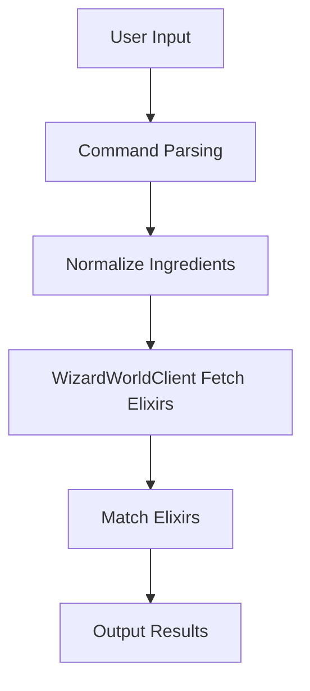
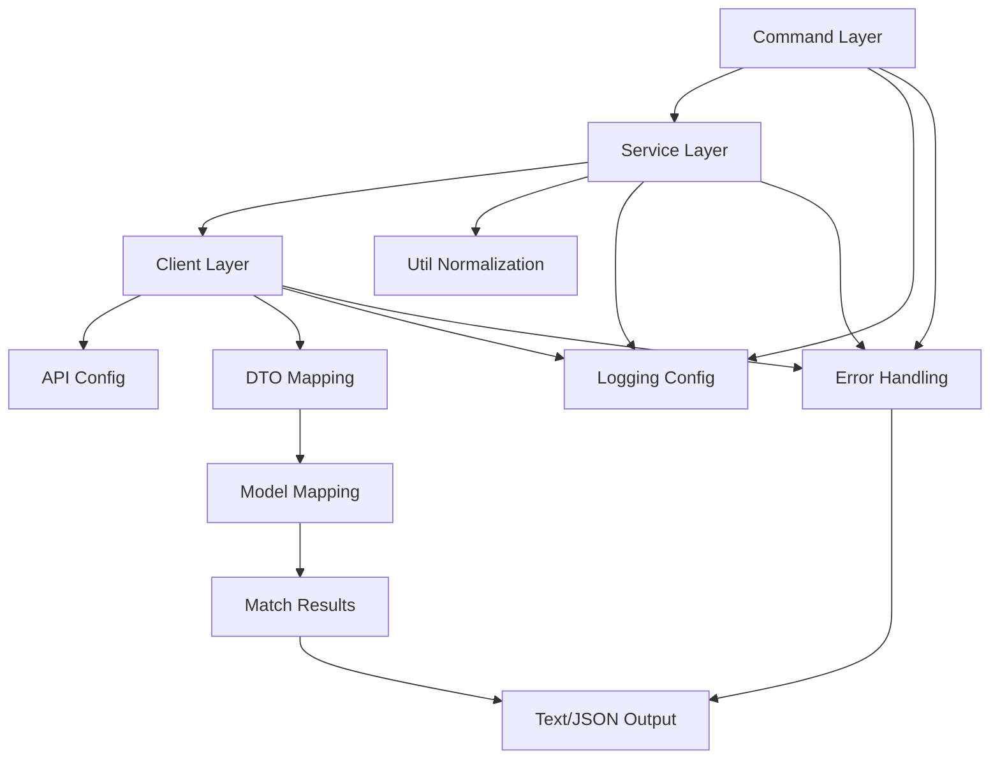
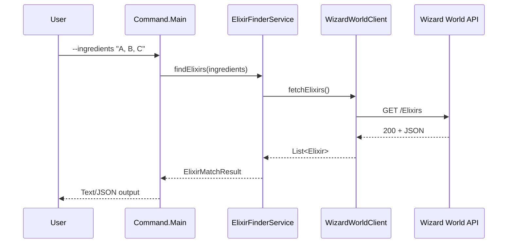

# Architecture

## Overview
This project is a console application that determines which Wizard World elixirs (potions) can be brewed from a user-provided set of ingredients. The app integrates with the Wizard World API, normalizes ingredient data, and computes a feasible set of elixirs based on available ingredients.

The key goals are:
- Clear separation between CLI, domain logic, and API integration.
- Deterministic, testable matching logic.
- Resilient network behavior with helpful error messages.

## High-Level Flow
1. Parse CLI arguments / prompts to collect available ingredients.
2. Normalize ingredient inputs (case, whitespace, synonyms if configured).
3. Fetch ingredient and elixir datasets from the Wizard World API.
4. Build a normalized ingredient index.
5. For each elixir, check whether all required ingredients exist in the available set.
6. Print sorted results and optional diagnostics.







## Proposed Modules

### 1) Command Layer (`src/main/.../command`)
**Responsibilities**
- Parse command-line arguments or prompt user input.
- Provide UX for loading and results.
- Print usage/help and errors.

**Interfaces**
- `InputParser` – parses user input into a `Set<String>` of ingredient names.
- `OutputFormatter` – prints results in a consistent format.

### 2) Service Layer (`src/main/.../service`)
**Responsibilities**
- Orchestrate the flow: input normalization, data retrieval, matching, output.
- Handle errors and fallback behaviors.

**Interfaces**
- `ElixirFinderService` – public entrypoint for matching elixirs.

### 3) Model Layer (`src/main/.../model`)
**Responsibilities**
- Core matching algorithm and data model.

**Entities**
- `Ingredient` – normalized ingredient name and metadata (if needed).
- `Elixir` – name, effect, list of required ingredients.

**Algorithm**
- Build `Set<String>` of available ingredients.
- For each elixir:
  - Normalize the required ingredient names.
  - If every required ingredient is in available set, include elixir.

**Complexity**
- Index creation: O(n) for ingredients.
- Matching: O(m * k) for m elixirs and k ingredients per elixir, using hash-set membership.

### 4) Client Layer (`src/main/.../client`)
**Responsibilities**
- API client for Wizard World endpoints.
- JSON parsing into domain models.

**Interfaces**
- `WizardWorldClient` – fetches `List<Elixir>` and `List<Ingredient>`.

**Implementation Notes**
- Use a standard HTTP client.
- Parse JSON with a reliable library (e.g., Jackson).
- Add timeouts and retry policy (1-2 retries with backoff) to avoid hanging.
- Handle API errors with clear messages.

### 5) Configuration & Utilities (`src/main/.../config`, `src/main/.../util`)
**Responsibilities**
- Base URL and endpoint paths.
- Optional ingredient synonym mapping.
- Normalization utilities.

## Data Model

### Ingredient
- `id` (String)
- `name` (String)

### Elixir
- `id` (String)
- `name` (String)
- `effect` (String)
- `ingredients` (List<String>)

Note: The API may include partial data; the model should handle missing fields safely.

## Matching Logic Details

1. Normalize input ingredients:
   - Lowercase
   - Trim whitespace
   - Replace consecutive spaces with a single space
2. Normalize API ingredient names the same way.
3. Map available ingredients into a `Set<String>`.
4. For each elixir, normalize its ingredient list and check if all are in the set.
5. Sort output alphabetically for predictable results.

## Error Handling
- Network failures: show a clear message and exit with non-zero status.
- Empty input: prompt user or print usage.
- API data inconsistencies: ignore invalid entries; log or warn.

## Logging
- Use a simple logger with levels (INFO/ERROR).
- Optional verbose flag to print API response counts and matching diagnostics.

## Testing Strategy
- Unit tests for normalization and matching logic.
- Mocked integration tests for API client.
- CLI tests for input parsing and output formatting.

## Example CLI
```
$ nitro-wizard --ingredients "Boomslang Skin, Leech Juice, Lacewing Flies"
```

## Extensibility
- Add a cache layer for API responses (file or in-memory).
- Support multiple output formats (JSON, plain text).
- Add fuzzy matching or synonyms for ingredient names.

## Directory Layout (Suggested)
```
/IdeaProjects/nitro-wizard
  /src
    /main
      /java
        /.../command
        /.../service
        /.../model
        /.../client
        /.../util
    /test
  pom.xml
  architecture.md
```

## Assumptions
- Wizard World API is reachable and stable.
- Elixir ingredient lists are authoritative for matching.
- Ingredient names are unique after normalization.
